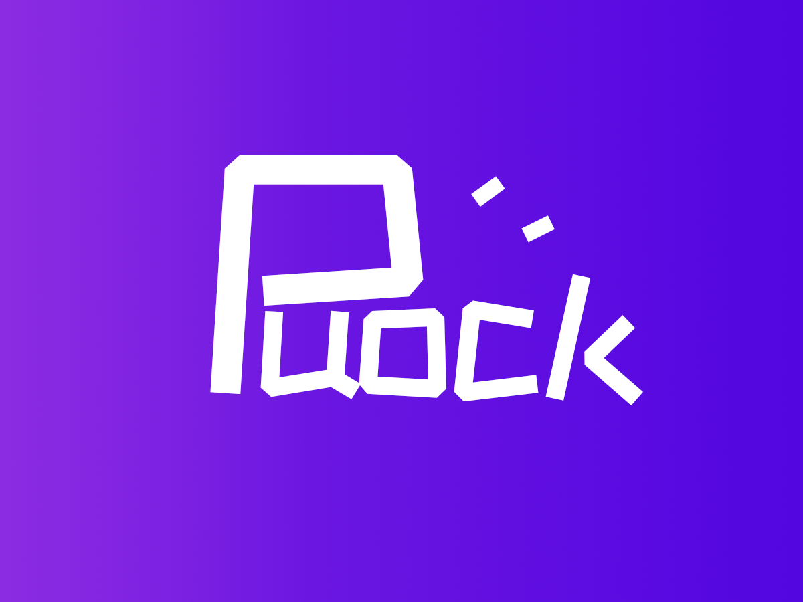

中文 | [English](./README_EN.md)

## 介绍

    <h1>WordPress Theme - Puock</h1>
    
一款基于WordPress开发的高颜值的自适应主题，支持白天与黑夜模式。

      
    
    
     
    
    
    
     
    
      
    </img>
      
    

## 配置截图

## 安装

请到 [发行版本](https://github.com/Licoy/wordpress-theme-puock/releases)
中进行下载最新版本，然后到WordPress管理后台中的「外观」-「主题」中点击「添加」，选择Puock的主题包进行上传安装并启用即可。

**提示：为了防止主题不兼容，请在安装主题前进行数据备份，防止数据字段重复覆盖等情况发生。**

**重要：请不要直接克隆或直接下载仓库进行使用，请到发行版中进行下载使用**

### 环境要求

- WordPress `>=6.0`
- PHP `>=7.4`

## 主题特性

- [x] 支持白天与暗黑模式
- [x] 全局无刷新加载
- [x] 支持博客、CMS、企业三种布局
- [x] 内置WP优化策略
- [x] 内置前台用户中心
- [x] 支持QQ / Github / Gitee / 微博登录
- [x] 支持缩略图伪静态
- [x] 全局顶部滚动公告
- [x] 图形及极验验证码支持
- [x] 自定义SMTP支持
- [x] 一键全站变灰
- [x] 网页压缩成一行
- [x] 后台防恶意登录
- [x] 内置出色的SEO功能
- [x] 评论ajax加载
- [x] 文章点赞、打赏、海报生成、分享
- [x] Twemoji集成
- [x] 丰富的广告位
- [x] 丰富的小工具
- [x] 自动百度链接提交
- [x] 众多页面模板（读者墙 / 归档 / 书籍推荐/ 站点导航 / 标签 / 站点地图等）
- [x] 众多短代码支持（下载 / 评论后可见 / 登录后可见 / 登录且验证邮箱可见 / 多种提示框 / Github卡片等）
- [x] 支持Dplayer播放器
- [x] 仿MacOS的代码风格及拷贝代码
- [x] Vue3+NaiveUI集成的高颜值后台配置
- [x] 文章多级目录生成
- [x] 侧边栏粘性滚动
- [x] WP缓存支持
- [x] 自定义主色调
- [x] LOGO扫光动画
- [x] ChatGPT及AI绘画支持
- [x] 更多特性更新请查阅版本发布说明：[releases](https://github.com/Licoy/wordpress-theme-puock/releases)
- [x] 更多功能等你的[提议](https://github.com/Licoy/wordpress-theme-puock/issues)

## 文档

- 主题使用文档：[立即使用](https://www.licoy.cn/puock-doc.html)
- **功能使用指南：[查看详细教程](./USAGE.md)** （友情链接、提示框等功能的详细使用说明）
- 建议或BUG反馈：[立即进入](https://github.com/Licoy/wordpress-theme-puock/issues)
- QQ/微信交流群：[点我加入](https://licoy.cn/go/puock-update.php?r=qq_qun) （此群皆为大家提供交流使用的地方，有BUG请直接提交ISSUE）
- **若您有任何建议或BUG发现，并且您也有解决或实现的思路，欢迎直接提交PR！**

## 支持

- 捐赠我们以支持更好的发展：[点我进入](https://licoy.cn/puock-theme-sponsor.html)

## 趋势

## 鸣谢
- [Jetbrains](https://www.jetbrains.com/?from=wordpress-theme-puock)

## 开源协议

- [GPL V3.0](./LICENSE)
- 请遵守开源协议，保留主题底部的署名
